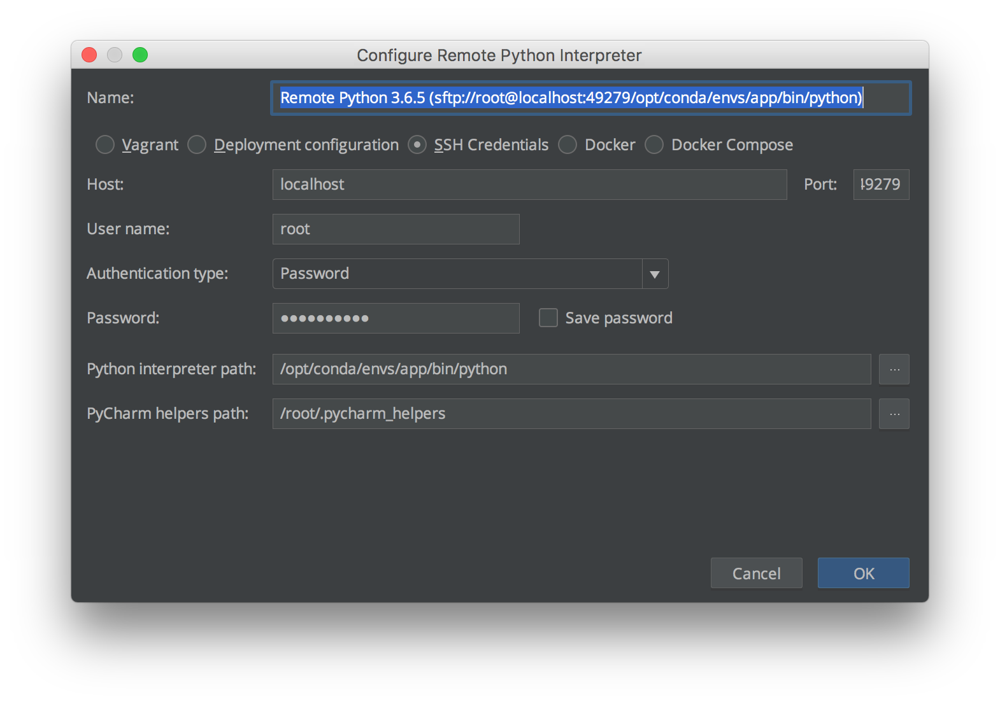
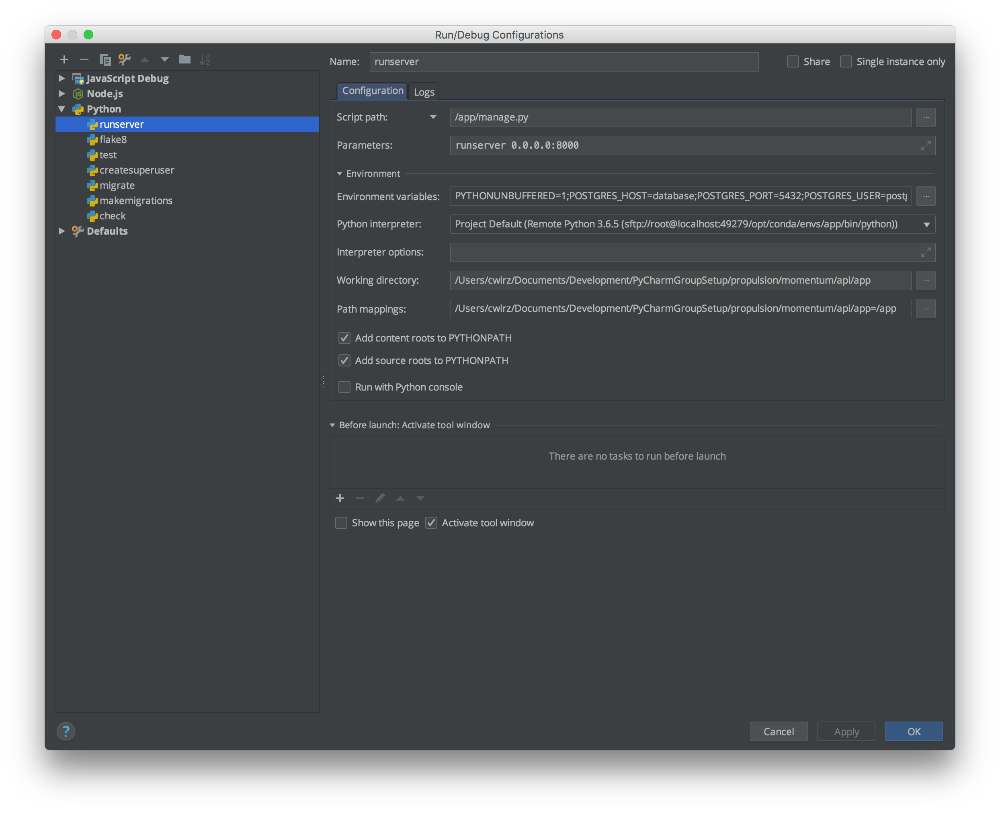
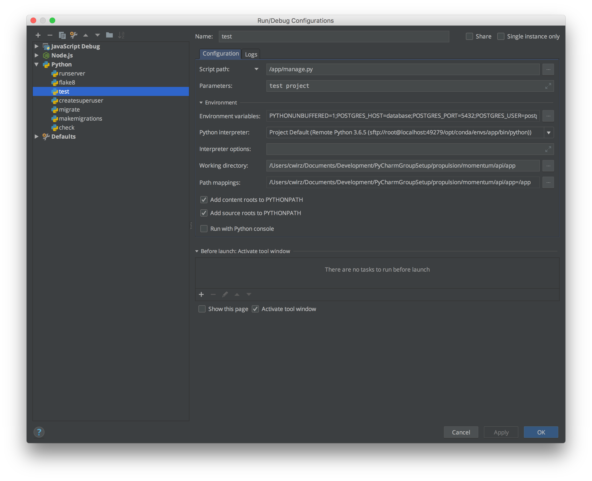
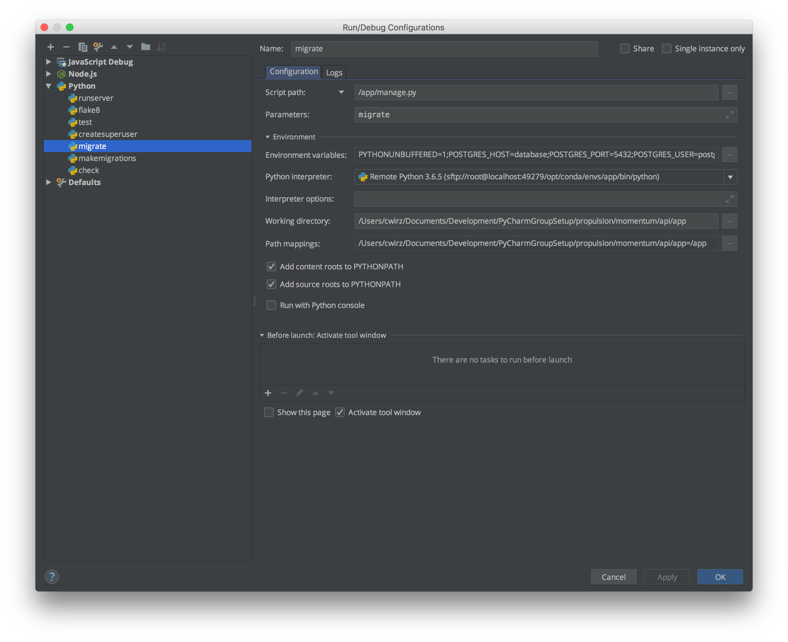

# Jacob Project

## Development

- Use `docker-compose up -d` to start all containers and let pycharm connect to the container via ssh.
- Use `docker ps` outside of the container and find the running app container name.
- Run `docker exec -ti <CONTAINER_NAME> bash` to access the running container from a second session
  and run development commands like `python manage.py createsuperuser` or `python manage.py migrate`.
- Visit [http://localhost:8875/backend/admin](http://localhost:8875/backend/admin) and login

### Interpreter settingss

| Interpreter settings                                                        | Django Runserver settings                                                        | Django test settings                                                        | Django management command settings                                                        |
|-----------------------------------------------------------------------------|----------------------------------------------------------------------------------|-----------------------------------------------------------------------------|-------------------------------------------------------------------------------------------|
|  |  |  |  |
| UN: **root**                                                                |                                                                                  |                                                                             |                                                                                           |
| PW: **screencast**                                                          |                                                                                  |                                                                             |                                                                                           |
| Port: **49279**                                                             |                                                                                  |                                                                             |                                                                                           |
| Host: **localhost**                                                         |                                                                                  |                                                                             |                                                                                           |
| Python path: **/opt/conda/envs/app/bin/python**                             |                                                                                  |                                                                             |                                                                                           |

### Setup

**Note**: Your setup structure needs to be something like:

- jacob (folder to open in pycharm)
    - .idea
    - backend
    - frontend
    - config
    - nginx

### Debugging Management Commands in PyCharm

- Set up a run configuration for a python script https://djangotricks.blogspot.ch/2016/05/debugging-management-commands-in-pycharm.html
- Set the script to be the /api/app/manage.py file
- Set the paramaters to be the command that is to be debugged
- Copy-paste the Dev.env environment variables content into the PyCharm config
- Enter the path mapping for /app to your local config
- Place a breakpoint where you want and start debugging

### Database commands

- Login into the database SQL commandline
    - `docker exec -ti <database-container-name> psql -U postgres`
